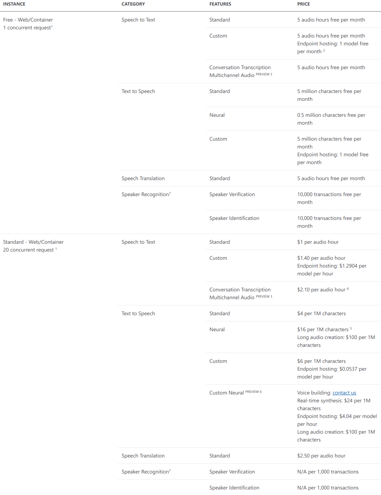

# AI-on-Microsoft-Azure

## Azure Cognitive Speech Services

### Speech-to-text Services

#### 1. Intro
 - 1.1 - Celem **Speech-to-text Services** jest zapewnienie w czasie rzeczywistym transkrypcji strumieni
 audio na podstawie uczenia maszynowego i sztucznej inteligencji.

 - 1.2 - **Speech-to-text Services** udostępnia API, które pozwala na transkrypcje głosową w cczasie rzeczywistym
 w aplikacjach czy usługach. Wystawiane są one jako niezależne platformy oparte o architekturę REST lub Speech SDK.

#### 2. Use cases
 - 2.1 - Tłumaczenie prezentacji na żywo
 - 2.2 - Napisy do mediów
 - 2.3 - Rozmowy tłumaczone zdalnie

#### 3. How to use
 - 3.1 Użycie niezależnej platformy RESTowej lub Speech SDK umożliwia integrację serwisów z dowolnymi usługami.
 Oba sposoby wymagają stworznia usługi na platformie Azure, gdzie wykorzystują klucz subskrybcji, jednak tylko wersji RESTowej
 dotyczy odpowiedni endpoint. Drugi sposób powiązany ze Speech SDK wymaga także doprecyzowania lokalizacji, z której korzysta usługa.
 We włąsnej aplikacji z obu elementów najlepiej korzystać poprzez język programowania Python lub #C.

### Text-to-Speech Services

#### 1. Intro
 - 1.1 - Celem **Text-to-Speech Services** jest przetwarzanie tesktu na mowę, czyli jest to syntezator mowy.

 - 1.2 - **Text-to-Speech Services** pozwala na wykorzystanie zbioru syntezatorów, gdzie wprowadzany tekst jest syntezowany
 i generowany na słowa. Dzięki rozwojowi brzmi co raz bardziej jak człowiek. Do wyboru są głosy:
    - standardowe - brzmiące naturalnie męskie i żeńskie głosy, gotowe do użycia
    - neuronowe - ulepszane przez sieci neuronowe głosy standardowe

#### 2. Use cases
 - 2.1 - Asystenci głosowi w czatach
 - 2.2 - Mowa w nawigacji GPS
 - 2.3 - Czytanie stacji/przystanków w komunikacji miejskiej
 - 2.4 - Konwertowanie plików tekstowych na audio

#### 3. How to use
 - 3.1 - Użycie niezależnej platformy RESTowej lub Speech SDK umożliwia integrację serwisów z dowolnymi usługami.
 Oba sposoby wymagają stworznia usługi na platformie Azure, gdzie wykorzystują klucz subskrybcji, jednak tylko wersji RESTowej
 dotyczy odpowiedni endpoint. Drugi sposób powiązany ze Speech SDK wymaga także doprecyzowania lokalizacji, z której korzysta usługa.
 We włąsnej aplikacji z obu elementów najlepiej korzystać poprzez język programowania Python lub #C.

### Speech Recognition API

#### 1. Intro
 - 1.1 - Celem **Speech Recognition API** jest rozpoznawanie i tłumaczenie mowy poprzez przeszkolone modele.

 - 1.2 - **Speech Recognition API** model jest szkolony w zakresie interakcji człowiek-człowiek, a nie poleceń
  człowiek-maszyna, dzięki czemu rozpoznawanie mowy jest zoptymalizowane pod kątem normalnych rozmów.

#### 2. Use cases
 - 2.1 - Tłumaczenie prezentacji na żywo
 - 2.3 - Obsługa klienta w różnych językach
 - 2.4 - Tłumaczenie rozmowy dwóch osób, bez słownika

#### 3. How to use
 - 3.1 - Użycie niezależnej platformy RESTowej lub Speech SDK umożliwia integrację serwisów z dowolnymi usługami.
   Oba sposoby wymagają stworznia usługi na platformie Azure, gdzie wykorzystują klucz subskrybcji, jednak tylko wersji RESTowej
   dotyczy odpowiedni endpoint. Drugi sposób powiązany ze Speech SDK wymaga także doprecyzowania lokalizacji, z której korzysta usługa.
   We włąsnej aplikacji z obu elementów najlepiej korzystać poprzez język programowania Python lub #C.

### Speech Translation API

 #### 1. Intro
  - 1.1 - Celem **Speech Translation API** jest zapewnienie usługi opartej na uczeniu maszynowym i sztucznej inteligencji, skupiającej się
  na wielojęzycznym tłumaczeniu mowy w czasie rzeczywistym.
  
  - 1.2 - **Speech Translation API** wykorzystuje detekcje ciszy, determinującą koniec frazy, a następnie po przerwie
  serwis odsyła opracowany rezultat. W celu zachowania ciągłości w tłumaczeniu, usługa przesyła częsciowe wyniki tłumaczenia
  dla procesowanej frazy. Gdy chemy uzyskać ostateczny rezultat, zapewniona jest synteza mowy z tekstu mówionego w docelowych

 #### 2. Use cases
  - 2.1 - Tłumaczenie odtwarzanych plików
  - 2.3 - Tłumaczenie filmów
  - 2.4 - Tłumaczenie audio

 #### 3. How to use
  - 3.1 - Użycie niezależnej platformy RESTowej lub Speech SDK umożliwia integrację serwisów z dowolnymi usługami.
    Oba sposoby wymagają stworznia usługi na platformie Azure, gdzie wykorzystują klucz subskrybcji, jednak tylko wersji RESTowej
    dotyczy odpowiedni endpoint. Drugi sposób powiązany ze Speech SDK wymaga także doprecyzowania lokalizacji, z której korzysta usługa.
    We włąsnej aplikacji z obu elementów najlepiej korzystać poprzez język programowania Python lub #C.

### Pricing dla Europy Zachodniej:
