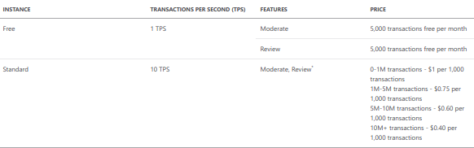

# AI-on-Microsoft-Azure

## Azure Cognitive Language Services

### Azure Content Moderator

#### 1. Intro
 - 1.1 - Celem **Azure Content Moderatora** jest wspomagane maszynowo moderowanie obrazów, tekstu i filmów wideo.
 
 - 1.2 - **Azure Content Moderator** rozszerza możliwości moderowania treści przez człowieka. Pozwala na 
 blokowanie zawartości, zatwierdzanie, czy przeglądanie zawartości na podstawie ustawionych progów, które sami 
 definiujemy albo korzystamy z wbudowanych możliwości. Odpowiedzi z API serwisu mogą być następujące:

    - Lista potencjalnie niechcianych wyrazów
    - Typ niechcianych wyrazów
    - Możliwe informacje o danych osobowych (PII) znalezionych w tekście
            

#### 2. Use cases
 - 2.1 - Moderowanie czatu
 - 2.2 - Filtracja negatywnych komentarzy w serwisach
 - 2.3 - Tworzenie czat botów, które wykonują czynności dla konkretnych zapytań
 - 2.4 - Moderacja treści na portalach

#### 3. How to use
 - 3.1 Możliwe ścieżki użycia po wykonaniu żądania POST dla endpointu Content Moderatora, który składa się z URL z flagami dla konfiguracji
  i przesłanego do analizy tekstu:
    - Klasyfikacja
        - Kategorie: 
        
            - **Kategoria 1**: język uznawany za seksualny lub zawierający treści dla dorosłych w niektórych sytuacjach
            - **Kategoria 2**: język uznawany za potencjalnie seksualny lub zawierający treści dla dorosłych w niektórych sytuacjach
            - **Kategoria 3**: język uznawany za obraźliwy w niektórych sytuacjach
        - Kategoria jest zwracana z oceną w skali 0-1, z pewnością przydzielonej kategorii. Paramter **"ReviewRecommended"** ustawiony na
        **true** sugeruje ręczne przejrzenie zawartości
        - Przykładowa odpowiedź:
        
        ```
        {
            "Classification": {
                "ReviewRecommended": true,
                "Category1": {
                    "Score": 1.5113095059859916E-06
                },
                "Category2": {
                    "Score": 0.12747249007225037
                },
                "Category3": {
                    "Score": 0.98799997568130493
                }
            }
        }
        ```
        
    - Wulgaryzmy - mapowane i zwracane, gdzie **"Term"** jest elementem wulgarnym, **"index"**, pokazuje
    gdzie znajduje się słowo w tekście, **"ListId"** wskazuje konkretny wyraz z listy terminów
        Przykładowa odpowiedż:
        
        ```
        "Terms": [
        {
            "Index": 118,
            "OriginalIndex": 118,
            "ListId": 0,
            "Term": "crap"
        }
        ```
    - Dane osobowe (PII) - zawiera informacje na temat danych osobowych np. mail, adresy IP, numery telefonów itd.
        Parametr **"Detected"** przedstawia rozpoznaną frazę, **"Text"** wskazuje fragment tekstu, **"Index"** położenie frazy w tekscie.
        Przykładowa odpowiedź: 
            
        ```
        "PII": {
            "Email": [{
                "Detected": "abcdef@abcd.com",
                "SubType": "Regular",
                "Text": "abcdef@abcd.com",
                "Index": 32
                }]
            }
        }
        ```
            
 - 3.2 - Pricing dla Europy Zachodniej:<br/><br/>
 

### Language Understanding Intelligent Service(LUIS)

#### 1. Intro
 - 1.1 - Celem **Language Understanding Intelligent Service** wyszukiwanie fraz w tekscie, 
 tak aby rozpoznać znaczenie i wykonać zautomatyzowane operacje, w interakcji z użytkownikiem.

 - 1.2 - **LUIS** korzysta z trzech kluczowych elementów:
    - Utterances - zdania wysłane do serwisu
    - Intents - akcje wykonana po analizie frazy
    - Entities - słowa, które wydobywamy z frazy
    
    Dzięki tym elementom bot jest w stanie wykonać zlecone mu akcje np. rezerwacja terminu 
    w zakładzie samochodowym  

#### 2. Use cases
 - 2.1 - różnego rodzaju rezerwacje
 - 2.2 - punkty informacyjne
 - 2.3 - wyszukiwanie treści, których oczekuje użytkownik
 - 2.4 - automatyzowanie procesów np. wysyłania danych

#### 3. How to use
 - 3.1 - Usługa korzysta z gotowego środowiska wdrożeniowego, w którym można zdefiniować 
 własny słownik "Utterances" zebranych pod wspólnym "Intents", gdzie oznacza się "Entities" w zdaniu.
 
 - 3.2 - Pricing dla Europy Zachodniej:<br/><br/>
 

### Text Analytics API

#### 1. Intro
 - 1.1 - Celem **Text Analytics API** jest interpretacja i analiza nieustrukturyzowanego tekstu, tak by można było 
zdefiniować wydzwięk danego rodzaju pytań. Obejmuje to analizę tonacji, wyodrębnienie 
kluczowych fraz, czy wykrywanie języka.

 - 1.2 - **Text Analytics API** ułatwia wyodrębnianie informacji z tekstu. Serwis ten pomaga w analizowaniu m.in. opinii użytkowników na temat dostarczanego
 produktu, czy tendencji w zmianach wprowadzanych w ramach tego produktu. Głównym narzędziem
 wykorzystywanym w analizie tonacji są sieci neuronowe, gdzie używane są gotowe modele stworzone przez
 Microsoft, dzięki czemu klient nie musi się martwić o tworzenie, często kosztownych i skomplikowanych modeli.
            

#### 2. Use cases
 - 2.1 - analiza opinii klientów dla sklepów
 - 2.2 - informacje o intencjach użytkowników
 - 2.3 - automatyczne dopasowanie języka w rozmowie np. w hotelu

#### 3. How to use
 - 3.1 - Usługa korzysta z algorytmu klasyfikacji uczenia maszynowego do generowania wyniku tonacji pomiędzy 0 a 1. Wyniki zbliżone
do wartości 1 wskazują pozytywną tonację, natomiast wyniki zbliżone do wartości 0 — negatywną tonację. Wynik zbliżony do wartości 0,5
oznacza brak tonacji lub neutralną tonację. Opiera się o strukturę żądania POST (url: https://westeurope.api.cognitive.microsoft.com/text/analytics/v2.0/sentiment)
do przygotowanego endpointu **'/sentiment'**, **'/languages'**, **'/keyPhrases'**, **'/entities'**, a w odpowiedzi w formie JSON-a otrzymuje wynik analizy. Każdy request składa się z obektu,
który posiada klucz **id** (dowolny unikatowy znak), **text** i **language** (nieobowiązkowy, gdy chcemy poznać język):
    
    ```
    {
        "documents": [
            {
                "id": "1",
                "text": "Hello world"
            }]
        }
    }
    ```
    
    Odpowiedź endpointu: 

    ```
    {
        "documents": [{
            "id": "1",
            "detectedLanguages": [{
            "name": "English",
            "iso6391Name": "en",
            "score": 1.0
        }]
    }
    ```
    
 - 3.2 - Pricing dla Europy Zachodniej:<br/><br/>
 