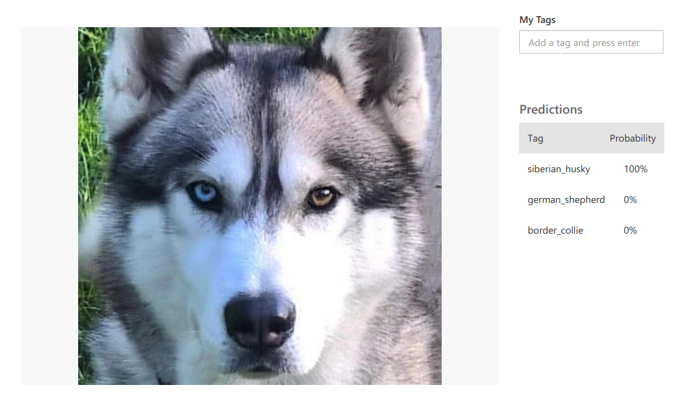
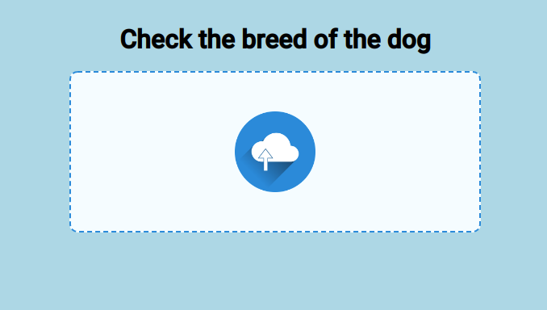

# AI-on-Microsoft-Azure

## Klasyfikacja piesków

#### 1. Use Case
 - 1.1 - Klasyfikator ma służyć do rozpoznania rasy pieska po udostępnieniu jego zdjęcia.
 
   W obecnej formie klasyfikator realizuje rozpoznanie 5 ras psów:
      - Border Collie
      - Owczarek Niemiecki
      - Golden Retriver
      - Labrador
      - Husky
 
   Rozwiązanie zakłada **2 sposoby** skorzystania z przygotowanego klasyfikatora:
      - Serwis **Custom Vision**, w którym użytkownik po wyborze testowania może udostępnić zdjęcie i czekać na odpowiedź z danymi
      - Aplikacja webowa **vision-app**, w której użytkownik po upuszczeniu zdjęcia w odpowiednim miejscu po chwili otrzymuje wynik

#### 2. Budowa klasyfikatora
  Do budowy klasyfikatora użyta została platforma webowa dostarczona przez Microsoft Azure pod nazwą **Custom Vision**. Aplikacja umożliwia
  przygotowanie detekcji obiektów, jak i klasyfikacji, gdzie ze względu na postawiony problem wybrano drugie rozwiązanie.
 - 2.1 - Kroki
    - Skrypt pythonowy **icrawler.py** - posłużył do pobrania na podstawie przeglądarki Bing ok. 700 zdjęć dla każdej rasy w celu przygotowania
    odpowiedniego zbioru treningowego
 
    - **Custom Vision Service**
       - stworzenie odpowiednich tagów dla piesków: border_collie, german_shepherd, golden_retriver, labrador, siberian_husky
    
       - wczytanie dla każdego tagu odpowiedniego zbioru danych
        
       - selekcja zdjęć dla tagów, gdzie średnio pozostało ich ok. 350-500 dla każdej rasy
        
       - rozpoczęcie zaawansowanego trenowania na czas 1h
        
       - uzyskanie odpowiedniego wyniku dla zdjęć testowych
       
        
        
       - publikacja endpointu
       
    - Aplikacja Webowa **vision-app** (localhost)
    
       - budowa prostej aplikacji webowej w Angularze umożliwiającej wykonanie zapytania do opublikowanego klasyfikatora
       
         

#### 3. Architektura
 Klasyfikator oparty jest o architekturę RESTową w przypadku aplikacji webowej. Umieszczone zapytanie typu POST przekazuje zdjęcie
 w postaci binarnej i wykonuje zapytanie. W przypadku serwisu na platfomie Microsoft, elementy tagowania, trenowania i testowania odbywają
 się w tym samym miejscu. Tam też uploadowane pliki i wyniki zostają zapisane w zakładce predykcji.

#### 3. Kod
 Kod umieszczony został w folderze pod nazwą **vision-app**, jest to aplikacja Angularowa, której elementy do uruchomienia aplikacji opisane są w README.MD.
 
 Aplikacja umieszczona w **Custom Vision Service** nie pozwala na udostępnienie kodu.
 
 #### 4. Wideo na YT
 
 Youtube video: https://youtu.be/usQSQ8d7hiM
